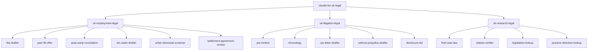
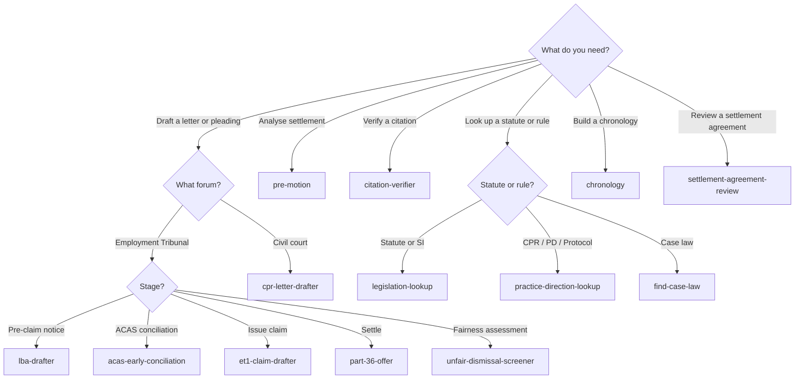

# Claude for UK Legal

UK-jurisdiction Claude plugins paired with [anthropics/claude-for-legal](https://github.com/anthropics/claude-for-legal) (US). Three plugins, fifteen skills, England & Wales civil and employment law.

> **Demonstration repository.** This is a worked example of what UK-jurisdiction Claude plugins can look like — not a production legal tool. Every output is a draft for solicitor review, not legal advice, and the skills are not a substitute for a qualified lawyer. Don't run these in a regulated workflow without a practising solicitor in the loop.

## What's in it



| Plugin | Coverage | Skills |
|---|---|---|
| [`uk-employment-legal`](./uk-employment-legal) | England & Wales employment law | 6 |
| [`uk-litigation-legal`](./uk-litigation-legal) | England & Wales civil litigation (CPR + PD 57AD) | 5 |
| [`uk-research-legal`](./uk-research-legal) | Primary-source legal research | 4 |

## Install

```bash
/plugin marketplace add https://github.com/b1rdmania/claude-for-uk-legal
/plugin install uk-employment-legal@claude-for-uk-legal
/plugin install uk-litigation-legal@claude-for-uk-legal
/plugin install uk-research-legal@claude-for-uk-legal
```

## Which skill do I use?



## Why this exists

Anthropic shipped `claude-for-legal` for the US in April 2026. There is no UK equivalent. English and Welsh law differs from US law in every meaningful way for these workflows:

| Layer | UK (England & Wales) | US |
|---|---|---|
| Procedural rules | CPR + PD 57AD | FRCP |
| Pre-action regime | PACC + sector protocols | Open notice pleading |
| Disclosure | Disclosure Pilot Models A–E, or CPR 31 | Broad discovery |
| Settlement | Part 36 + Calderbank + ACAS COT3 | Rule 68 |
| Employment claims | Employment Tribunal, 3-month limits, ACAS EC | EEOC + state tribunal patchwork |
| Privilege | Legal advice + litigation privilege + WP | Attorney-client + work product |
| Citation | Neutral citations since 2001 + Find Case Law | Reporter system + Westlaw / LexisNexis |

A US-trained skill in UK hands produces output that looks competent and is wrong in ways a non-lawyer can't catch. This repo is the UK-grounded counterpart.

## Coverage

England & Wales civil and employment law. **Not covered:**

- Scotland (Court of Session / Sheriff Court; separate ET; Pursuers' / Defenders' offers; different settlement-agreement conditions).
- Northern Ireland (RCJ NI; Industrial Tribunals; LRA equivalents of ACAS).
- Criminal procedure.
- Family procedure.
- Tax tribunal procedure beyond signposting.

## Guardrails

Every skill is built with the discipline UK regulators expect of AI-assisted legal work:

- **Solicitor in the loop.** Output is a draft. Counsel reviews.
- **Statutory citation per assertion.** Every legal claim cites the statute, rule, or authority it relies on.
- **Time-limit gates.** Drafting skills compute the limitation date before generating. Missed limitation is the most common malpractice in employment law.
- **CPR 31.22 implied undertaking screen.** Document-handling skills confirm permitted use before extracting from disclosed material.
- **Privilege posture.** Chronology and disclosure skills record their posture (cleared / mixed / paused) in the output header.
- **Citation anti-hallucination.** A dedicated verifier exists to catch fabricated cases before they reach a brief. AI-hallucinated cites have already led to UK tribunal sanction ([Harber v HMRC](https://www.bailii.org/uk/cases/UKFTT/TC/2023/TC09010.html)).

## What this repo doesn't do

- Provide legal advice.
- Replace a qualified solicitor.
- Cover Scotland or Northern Ireland.
- Maintain currency without contribution — UK law moves (Employment Rights Bill 2025, CPR updates three times a year, Vento bands and statutory caps annually).
- Run without Claude Code or Claude Cowork installed.

## Status

`v0.1.0` — initial release, May 2026. Demo positioning. Maintained by [@b1rdmania](https://github.com/b1rdmania).

Roadmap (`v0.2`):

- MCP connectors for Find Case Law and legislation.gov.uk (currently HTTP fetch).
- `uk-employment-legal` — discrimination quantum analysis (Vento bands).
- `uk-litigation-legal` — interim relief, freezing orders, security for costs.
- New plugins: `uk-property-legal` (conveyancing, lease review), `uk-corporate-legal` (Companies Act, directors' duties).

## Contributing

See [CONTRIBUTING.md](./CONTRIBUTING.md). Corrections from practising UK solicitors are particularly welcome — please flag your role in PR descriptions.

## License

Apache-2.0. See [LICENSE](./LICENSE).

## Disclaimer

This repository provides software tools that may assist in the production of legal work-product. It does not provide legal services or legal advice. The skills are designed to be used by qualified lawyers under their professional supervision. Use by non-lawyers in a regulated legal context may breach the Legal Services Act 2007 and the SRA Standards and Regulations.
