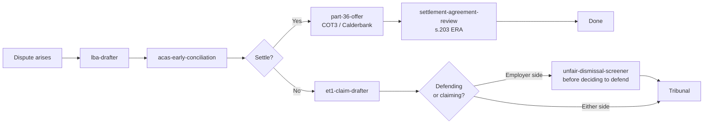
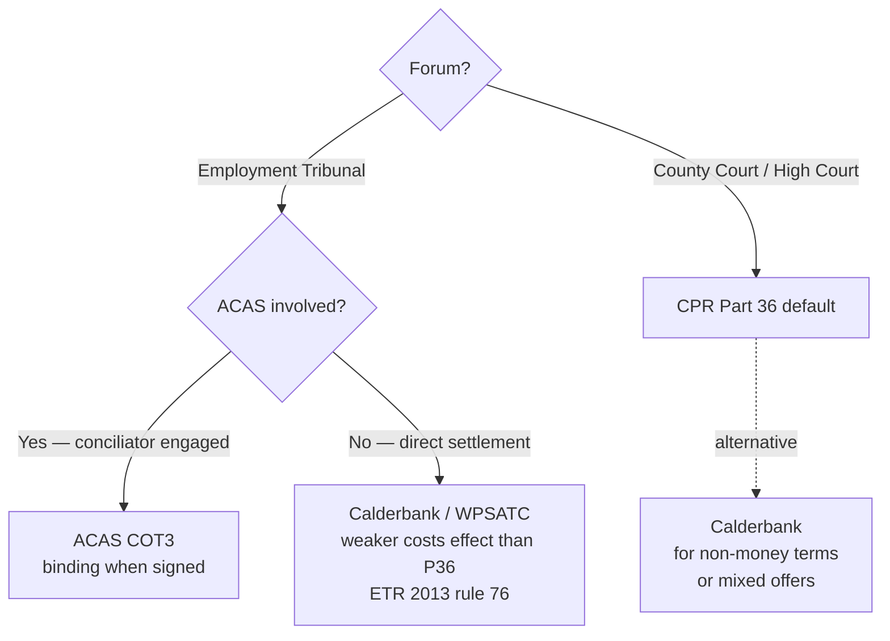

# uk-employment-legal

England & Wales employment-law plugin for Claude. Six skills covering the claim lifecycle from pre-action notice through settlement.

> Demo plugin. Drafts for solicitor review. Not legal advice.

## The lifecycle



## Skills

| Skill | What it does |
|---|---|
| [`/uk-employment-legal:lba-drafter`](./skills/lba-drafter/SKILL.md) | Drafts a Letter Before Action for an ET or civil claim. Computes the ET 3-month limit before generating — a polite pre-action letter doesn't stop the clock. |
| [`/uk-employment-legal:acas-early-conciliation`](./skills/acas-early-conciliation/SKILL.md) | Computes the s.207B ERA "stop the clock" extension (Day A, Day B, latest-issue date). Briefs the conciliator. |
| [`/uk-employment-legal:et1-claim-drafter`](./skills/et1-claim-drafter/SKILL.md) | Drafts the ET1 form and Grounds of Claim. Element-by-element pleading for every cause. |
| [`/uk-employment-legal:unfair-dismissal-screener`](./skills/unfair-dismissal-screener/SKILL.md) | Burchell + Polkey + ACAS Code analysis with a structured risk score. |
| [`/uk-employment-legal:part-36-offer`](./skills/part-36-offer/SKILL.md) | Picks the right settlement vehicle — CPR Part 36 (civil), Calderbank / WPSATC (ET), or ACAS COT3 — and drafts it. |
| [`/uk-employment-legal:settlement-agreement-review`](./skills/settlement-agreement-review/SKILL.md) | Tests s.203 ERA validity (in writing, named adviser, insurance, statement of conditions) and reviews substantive terms. |

## Install

```bash
/plugin marketplace add https://github.com/b1rdmania/claude-for-uk-legal
/plugin install uk-employment-legal@claude-for-uk-legal
```

## Settlement-vehicle decision

The single most-confused area in UK employment-claim practice. The wrong vehicle wastes the costs pressure entirely.



Part 36 does **not** apply in the Employment Tribunal. Calderbank does. ACAS COT3 is the binding-settlement vehicle once a conciliator is involved.

## Time limits

Most malpractice in employment law is missed limitation. Every drafting skill computes the latest-issue date and surfaces it in the output header.

| Claim | Primary limit | Statute |
|---|---|---|
| Unfair dismissal | 3 months less 1 day from EDT | s.111 ERA 1996 |
| Discrimination | 3 months less 1 day from act / last act in continuing course | s.123 EqA 2010 |
| Unlawful deduction | 3 months less 1 day from deduction (or last of series) | s.23 ERA 1996 |
| Equal pay | 6 months from end of employment | s.129 EqA 2010 |
| Redundancy payment | 6 months from relevant date | s.164 ERA 1996 |
| Statutory redundancy consultation | 3 months from dismissal | s.189 TULR(C)A 1992 |

ACAS early conciliation extends these via the s.207B "stop the clock" mechanism. The LBA does not.

## Coverage

England & Wales only. Does **not** cover:

- Scotland (separate Employment Tribunal regime; different statutory references).
- Northern Ireland (Industrial Tribunals; LRA equivalent of ACAS).
- Tax tribunal (FTT-TC).

For multi-jurisdiction matters, run the relevant local plugin per jurisdiction.

## What this plugin doesn't do

- Send anything externally — outputs are drafts.
- Replace independent legal advice for the s.203 settlement-agreement adviser certificate.
- Compute pension loss precisely — needs actuarial input.
- Quantify discrimination injury-to-feelings — needs Vento-band calibration (on the v0.2 roadmap).
- Cover the Employment Rights Bill 2025 day-one rights regime until the commencement order is in force (`[SME VERIFY]` markers in each skill flag the gap).

## Requirements

Claude Code or Claude Cowork. No external MCP connectors required for the drafting skills. The unfair-dismissal-screener and settlement-agreement-review skills are entirely local.

## Status

`v0.1.0` — May 2026. Open to corrections from practising employment solicitors. Please flag your role in PR descriptions.
