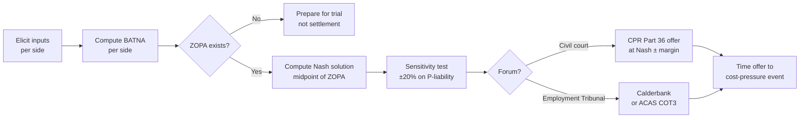
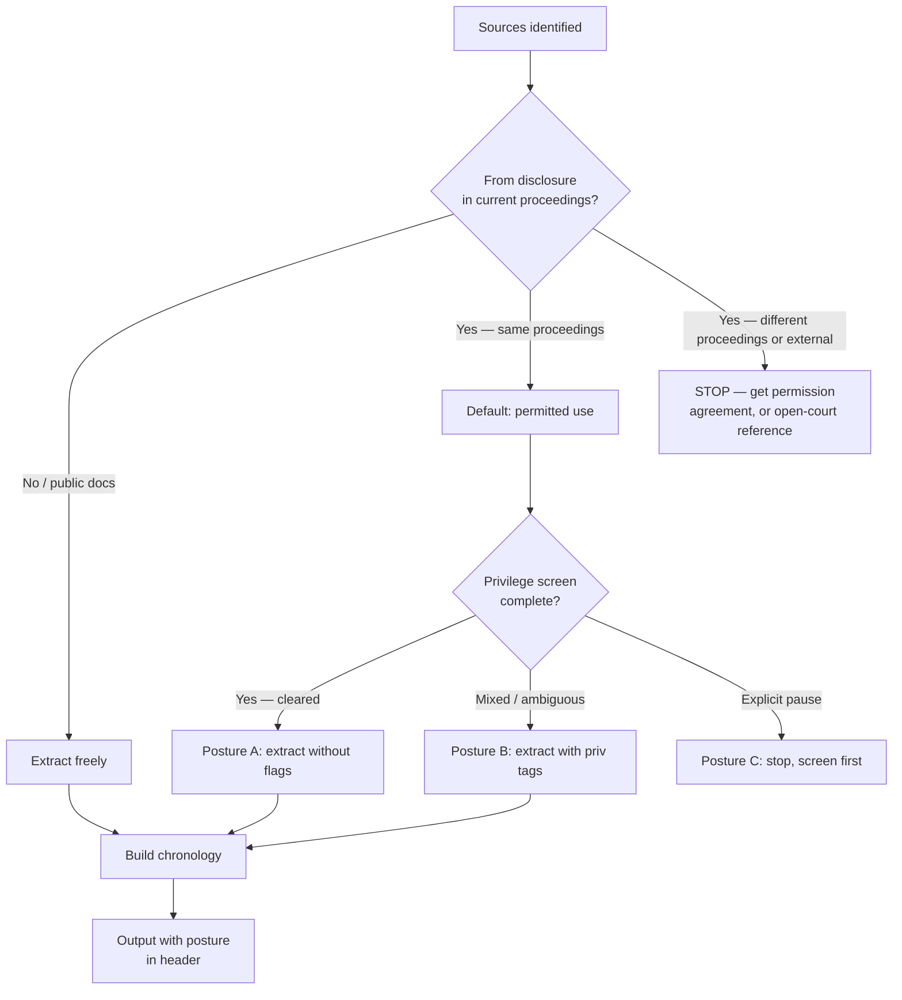
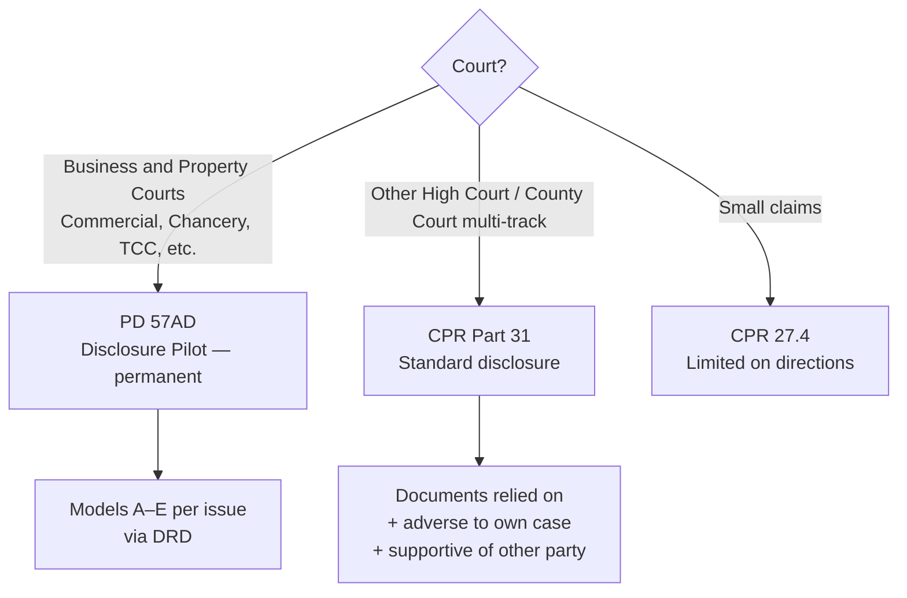

# uk-litigation-legal

England & Wales civil litigation plugin for Claude. CPR-aware. PD 57AD-aware. Five skills covering settlement analysis, evidence preparation, pre-action correspondence, privilege-footed drafting, and disclosure.

> Demo plugin. Drafts for solicitor review. Not legal advice.

## Skills

| Skill | What it does |
|---|---|
| [`/uk-litigation-legal:pre-motion`](./skills/pre-motion/SKILL.md) | Structured settlement analysis. BATNAs → ZOPA → Nash bargaining solution → Part 36 / Calderbank translation. |
| [`/uk-litigation-legal:chronology`](./skills/chronology/SKILL.md) | Builds a litigation chronology with the CPR 31.22 implied-undertaking gate. Source attribution per entry. SoF and witness-specific variants. |
| [`/uk-litigation-legal:cpr-letter-drafter`](./skills/cpr-letter-drafter/SKILL.md) | Letters Before Claim. Auto-selects the right protocol (Debt, Prof Neg, PI, Disrepair, Construction, JR, Defamation) or applies the default PACC. |
| [`/uk-litigation-legal:without-prejudice-drafter`](./skills/without-prejudice-drafter/SKILL.md) | Drafts on the correct privilege footing — open, WP, or WPSATC. Surfaces Unilever exceptions. |
| [`/uk-litigation-legal:disclosure-list`](./skills/disclosure-list/SKILL.md) | Builds a List of Documents (CPR 31) or Disclosure Review Document (PD 57AD). Model A–E selection per issue. |

## Install

```bash
/plugin marketplace add https://github.com/b1rdmania/claude-for-uk-legal
/plugin install uk-litigation-legal@claude-for-uk-legal
```

## Pre-Motion — the hero skill

Most settlement decisions in UK practice are made on intuition. Pre-Motion makes the inputs explicit, computes each side's BATNA, identifies whether a Zone of Possible Agreement exists, and finds the Nash bargaining solution within it. The recommendation is only as strong as the inputs — and the skill surfaces that.



### Inputs per side

| Input | Notes |
|---|---|
| Claim value (V) | Best-case quantum for the claimant |
| P(liability) × P(quantum) | Probability of success, broken into liability and quantum |
| Costs to trial (C) | Own-side legal spend through trial |
| Costs at risk | Other-side costs payable on loss |
| Risk tolerance | 0 risk-neutral → 1 risk-averse |
| Strategic value | Precedent, reputation, deterrence — surfaced not priced |

## Chronology — CPR 31.22 gate

Documents obtained through disclosure cannot be used outside the proceedings in which they were disclosed without permission, agreement, or open-court reference. Misuse is contempt of court.



The chronology skill enforces both gates and records the posture in every output. The SoF variant filters privilege-flagged entries by default.

## Disclosure regime

Which regime applies depends on the court.



The `disclosure-list` skill builds the right artefact for the right regime — N265 List of Documents under CPR 31, or a Disclosure Review Document under PD 57AD with per-issue Model selection.

## Without prejudice / Calderbank

The single most-misunderstood drafting decision in UK civil practice. The `without-prejudice-drafter` skill:

- Distinguishes open, WP, and WPSATC.
- Applies the right header convention.
- Surfaces the seven Unilever v Procter & Gamble exceptions where WP protection falls away.
- Keeps WP and open correspondence in separate documents.

## Coverage

England & Wales civil litigation. **Not covered:**

- Scotland (Court of Session / Sheriff Court — entirely different regime).
- Northern Ireland (Rules of the Court of Judicature NI).
- Criminal procedure.
- Family procedure (FPR — separate regime).
- Employment Tribunal procedure — see [`uk-employment-legal`](../uk-employment-legal).

## What this plugin doesn't do

- Issue claims or file documents — outputs are drafts.
- Decide privilege — the skills surface posture and flag entries; counsel makes the call.
- Resolve contradictions between sources in the chronology — both go in with flags.
- Run real Monte Carlo simulations in Pre-Motion (it computes deterministic ZOPA + sensitivity, which is usually enough).
- Cover Family / Criminal / Tribunal procedure rules.

## Requirements

Claude Code or Claude Cowork. No external MCP connectors required. All skills run locally on inputs the user provides.

## Status

`v0.1.0` — May 2026. Corrections from practising civil litigators welcome — particularly on PD 57AD Model selection in unfamiliar issue patterns.
