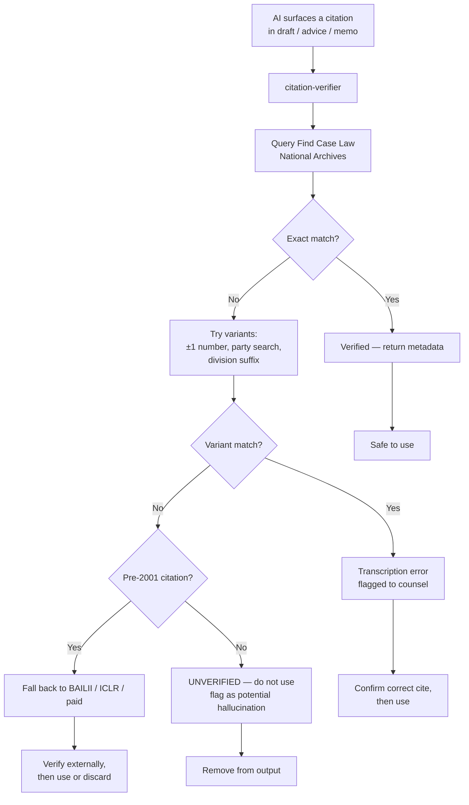
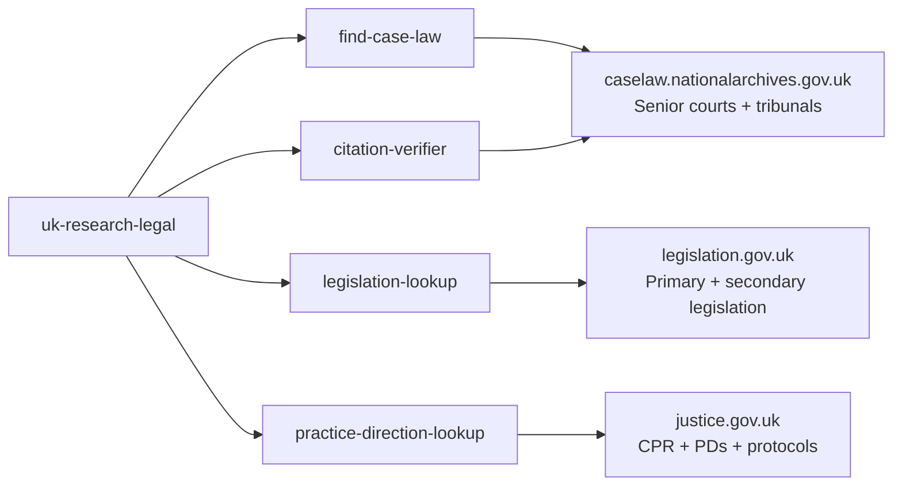

# uk-research-legal

UK legal research plugin for Claude. Primary-source first. Citation-hallucination resistant. Four skills covering case law, citation verification, legislation, and procedure rules.

> Demo plugin. Drafts for solicitor review. Not legal advice.

## Skills

| Skill | What it does |
|---|---|
| [`/uk-research-legal:find-case-law`](./skills/find-case-law/SKILL.md) | Queries the National Archives Find Case Law API for judgments from the senior English & Welsh courts. Returns metadata and a canonical link. |
| [`/uk-research-legal:citation-verifier`](./skills/citation-verifier/SKILL.md) | Verifies a citation against the authoritative register. Catches AI-hallucinated cases before they reach a brief. |
| [`/uk-research-legal:legislation-lookup`](./skills/legislation-lookup/SKILL.md) | Looks up primary and secondary legislation on legislation.gov.uk. Returns section text, in-force status, and amendments. |
| [`/uk-research-legal:practice-direction-lookup`](./skills/practice-direction-lookup/SKILL.md) | Looks up CPR rules, Practice Directions, Pre-Action Protocols, and court guides. |

## Install

```bash
/plugin marketplace add https://github.com/b1rdmania/claude-for-uk-legal
/plugin install uk-research-legal@claude-for-uk-legal
```

## The anti-hallucination flow

The `citation-verifier` skill is the most important defensive tool in the suite. UK courts have already sanctioned submissions that relied on AI-fabricated cases — [Harber v HMRC [2023] UKFTT 1007 (TC)](https://www.bailii.org/uk/cases/UKFTT/TC/2023/TC09010.html). Run every AI-surfaced citation through the verifier before it appears in any deliverable.



## Source map

Each skill talks to a different authoritative public-record source.



| Source | What it covers | What it doesn't |
|---|---|---|
| Find Case Law (caselaw.nationalarchives.gov.uk) | Senior courts since ~2001 (UKSC, EWCA, EWHC, UKUT, UKEAT). Authoritative public-record source. | Pre-2001 judgments are patchy. Doesn't carry headnotes, citator, or commentary. |
| legislation.gov.uk | All UK primary legislation, UK Statutory Instruments, retained EU law. "Latest available" and point-in-time views. | Commentary and practitioner annotations (paid sources). |
| justice.gov.uk | CPR, Practice Directions, Pre-Action Protocols, court forms. | Court guides — those live on judiciary.uk; FPR / CrimPR / tribunal rules separately. |

## Coverage caveats

- **Find Case Law** is comprehensive for senior courts post-2001 but coverage of older judgments is incomplete. For pre-2001 citations, fall back to BAILII (free, broader, less authoritative) or paid services (Westlaw, LexisNexis, ICLR).
- **legislation.gov.uk** is comprehensive for in-force UK legislation but commentary lags on retained EU law.
- **CPR Updates** are issued at least three times a year. The `practice-direction-lookup` skill checks the version banner and flags when a recent Update may have changed the rule.

## What this plugin doesn't do

- Provide commentary or annotation — use Westlaw, LexisNexis, Practical Law, or the practitioner texts (White Book, Halsbury, Blackstone, etc.).
- Cover Scottish or Northern Irish sources — Scottish Courts and Tribunals, Judiciary NI, equivalent legislation portals.
- Return a citator (judicial history, treatment, distinguishing authorities).
- Substitute for a qualified researcher on a complex point.

## Requirements

Claude Code or Claude Cowork. Currently uses HTTP fetch via Claude's tools to call the authoritative endpoints. A proper MCP connector is on the v0.2 roadmap.

```bash
# No API keys required — the National Archives and legislation.gov.uk
# endpoints are public and unauthenticated.
```

## Status

`v0.1.0` — May 2026. The `citation-verifier` workflow is the most reliable. The lookup skills will improve significantly when the MCP connector lands — currently they depend on Claude's HTTP-fetch capability and may fail silently if the endpoint is rate-limited or unavailable.

Roadmap (v0.2):

- MCP connector for Find Case Law and legislation.gov.uk (replaces HTTP fetch).
- Citator integration via a paid-source MCP if/when one becomes available.
- Tribunal rules lookup (UT, FtT, EAT) as a separate skill.
